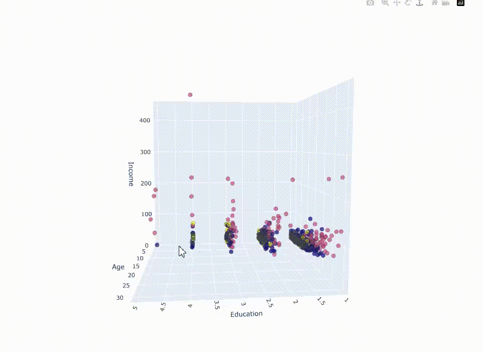

### Customer Segmentation Analysis built with: 
- **Python** for backend logic and data processing  
- **Pandas** & **NumPy** for data handling and feature transformation  
- **Scikit-Learn** for clustering models (**K-Means**)  
- **Matplotlib** & **Seaborn** for data visualization  
- **Plotly** for interactive 3D scatter plots  

---

# Customer Segmentation Using K-Means Clustering

This project applies **K-Means clustering** to segment customers based on various attributes such as **age, income, debt ratio, and employment years**. By grouping customers into clusters, businesses can tailor marketing strategies and financial offerings based on consumer profiles.  

## Key Insights:  
- Higher-income customers tend to have longer employment histories and lower debt ratios.  
- Debt-to-income ratio varies significantly across customer groups, impacting financial stability.  
- Education levels correlate with spending patterns, affecting financial decision-making.  
- Cluster labels help categorize customers, providing meaningful segmentation insights.  
- 3D scatter plots visually distinguish clusters, making customer patterns easier to interpret.  

---

## Visualization Gallery
- **Interactive 3D Scatter Plot (Education vs. Age vs. Income)**  


---

## Dependencies

```bash
pip install pandas numpy matplotlib seaborn scikit-learn plotly
```

---

## License

This project is licensed under the MIT License.
