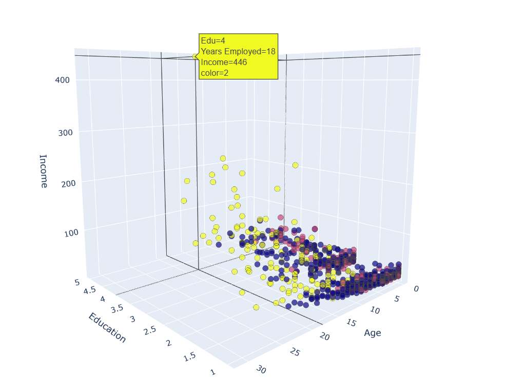

 # Customer Segmentation using K-Means Clustering

This project demonstrates how to perform customer segmentation using K-Means clustering with both synthetic data and real customer data. It includes data preprocessing, clustering analysis, and both 2D and 3D visualizations, including an interactive 3D plot using Plotly.

## 📌 Project Overview

Customer segmentation is a key task in understanding and targeting customer groups based on common characteristics. This project uses:

- **Synthetic data** (from `make_blobs`) for clustering demos
- **Real-world dataset** (`Cust_Segmentation.csv`)
- **K-Means Clustering** to group customers
- **Visualization** using Matplotlib and Plotly (2D & interactive 3D)

Key steps:
- Data cleaning & scaling
- Applying K-Means clustering with different `k` values
- Visualizing cluster groups
- Assigning human-readable labels to clusters

---

## 📂 Files

- `Customer Segmentation.ipynb` — main Jupyter Notebook with code
- `Cust_Segmentation.csv` — dataset for real-world customer segmentation
- `/images/3d_scatter.png` — screenshot of interactive 3D cluster plot

---

## 📸 Example Output

### 📈 Cluster Visualization (Interactive 3D Plot)

> Due to GitHub limitations, the interactive Plotly chart cannot be rendered here.  
> Below is a screenshot of the 3D cluster visualization:



---

## 🚀 How to Run

1. Clone the repository:
   ```bash
   git clone https://github.com/your-username/customer-segmentation.git
   cd customer-segmentation

2. Install the dependencies:
   ```bash
   pip install pandas numpy matplotlib scikit-learn plotly

3. Open the notebook:
    ```bash
    jupyter notebook "Customer Segmentation.ipynb"

4. Run all cells to perform clustering and generate visualizations.


## 📊 Clustering Results

Each customer is clustered into one of three main segments:

Cluster Label	 |Description
----------------|-----------
0|LATE CAREER, AFFLUENT, AND EDUCATED
1|MID CAREER AND MIDDLE INCOME
2|EARLY CAREER AND LOW INCOME


These segments are generated based on features like age, income, years employed, education, etc.

## 🛠 Libraries Used
````bash
pandas, numpy, matplotlib, scikit-learn, plotly
````


## 📬 Contact
If you have questions or suggestions, feel free to open an issue or contact me via email.


